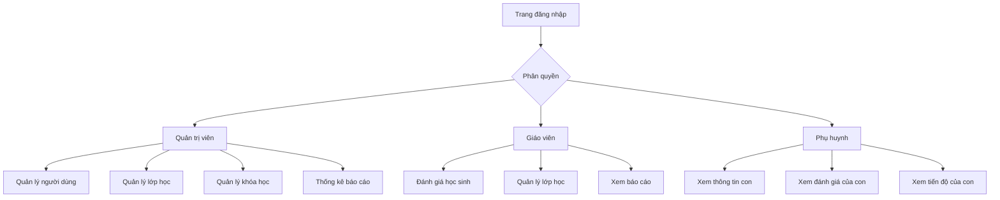

## 1. Tổng quan sản phẩm

Hệ thống quản lý giáo dục TueDuc_Edu là nền tảng quản lý trường học tập trung vào triết lý "3 Cội Nguồn" (Đức - Trí - Dục). Hệ thống giúp quản lý toàn diện các hoạt động giáo dục từ người dùng, lớp học, khóa học đến đánh giá học sinh.

Mục tiêu: Xây dựng môi trường giáo dục toàn diện phát triển cả về đạo đức, trí tuệ và ý chí cho học sinh.

## 2. Tính năng cốt lõi

### 2.1 Vai trò người dùng

| Vai trò | Phương thức đăng ký | Quyền hạn cốt lõi |
|---------|---------------------|-------------------|
| Quản trị viên | Tạo bởi hệ thống | Quản lý toàn bộ hệ thống, người dùng, cài đặt |
| Giáo viên | Đăng ký qua quản trị viên | Quản lý lớp học, khóa học, đánh giá học sinh |
| Phụ huynh | Đăng ký qua quản trị viên | Xem tiến độ học tập, đánh giá của con em |

*Ghi chú: Học sinh là đối tượng được quản lý nhưng không có tài khoản đăng nhập riêng. Phụ huynh sẽ đại diện quản lý thông tin của con.*

*Multi-child: 1 phụ huynh có thể liên kết nhiều học sinh (nhiều con) và có thể chuyển (switch) giữa các con để xem bài tập/điểm danh/đánh giá theo từng bé.*

### 2.2 Module chức năng

Hệ thống quản lý giáo dục TueDuc_Edu bao gồm các trang chính sau:

1. **Trang quản lý người dùng**: Danh sách người dùng, phân quyền, thông tin cá nhân
2. **Trang quản lý lớp học**: Danh sách lớp, học sinh trong lớp, giáo viên chủ nhiệm
3. **Trang quản lý khóa học**: Môn học, chương trình học, tài liệu học tập
4. **Trang đánh giá học sinh**: Nhập điểm, đánh giá theo 3 cội nguồn, báo cáo tiến độ
5. **Trang thống kê báo cáo**: Tổng hợp kết quả học tập, phân tích theo 3 cội nguồn
6. **Trang điểm danh**: Giáo viên điểm danh theo lớp/ngày, phụ huynh xem lịch sử điểm danh của con
7. **Trang bài tập về nhà**: Giáo viên tạo bài tập (trắc nghiệm/tự luận), chỉ định theo lớp hoặc theo học sinh; phụ huynh xem và nộp bài; giáo viên chấm điểm và theo dõi tiến độ
8. **Trang học phí**: Theo dõi học phí theo tháng của từng học sinh (đã đóng/còn nợ). Phụ huynh xem theo từng con và switch giữa các con
9. **Trang lương giáo viên**: Theo dõi lương theo tháng dựa trên lịch dạy theo ca và đơn giá theo ca

### 2.3 Chi tiết trang

| Tên trang | Module chức năng | Mô tả tính năng |
|-----------|------------------|-----------------|
| Quản lý người dùng | Danh sách người dùng | Xem, thêm, sửa, xóa người dùng theo vai trò |
| Quản lý người dùng | Phân quyền | Gán vai trò và quyền hạn cho từng người dùng |
| Quản lý người dùng | Thông tin cá nhân | Quản lý thông tin học sinh, giáo viên, phụ huynh |
| Quản lý lớp học | Danh sách lớp | Tạo, chỉnh sửa, xóa lớp học |
| Quản lý lớp học | Học sinh trong lớp | Thêm/xóa học sinh vào lớp, phân lớp tự động |
| Quản lý lớp học | Giáo viên chủ nhiệm | Phân công giáo viên quản lý lớp |
| Quản lý khóa học | Môn học | Tạo môn học theo chương trình giáo dục |
| Quản lý khóa học | Chương trình học | Thiết lập chương trình học theo khối lớp |
| Quản lý khóa học | Tài liệu học tập | Upload và quản lý tài liệu, bài giảng |
| Đánh giá học sinh | Nhập điểm | Nhập điểm theo môn học, kỳ thi |
| Đánh giá học sinh | Đánh giá 3 cội nguồn | Đánh giá về Đức, Trí, Dục cho từng học sinh |
| Đánh giá học sinh | Báo cáo tiến độ | Theo dõi tiến độ học tập của học sinh |
| Thống kê báo cáo | Tổng hợp kết quả | Thống kê điểm số, kết quả học tập |
| Thống kê báo cáo | Phân tích 3 cội nguồn | Phân tích sự phát triển toàn diện của học sinh |
| Điểm danh | Điểm danh theo ca | Tạo phiên điểm danh theo lớp + ngày + ca, nhập trạng thái (có mặt/vắng/trễ/có phép) |
| Điểm danh | Lịch sử điểm danh | Phụ huynh xem lịch sử điểm danh của con |
| Bài tập về nhà | Tạo bài tập | Giáo viên tạo bài tập trắc nghiệm/tự luận |
| Bài tập về nhà | Chỉ định đối tượng | Giao cho toàn bộ lớp hoặc chọn từng học sinh |
| Bài tập về nhà | Nộp bài | Phụ huynh nộp trắc nghiệm hoặc chụp ảnh bài tự luận và đính kèm |
| Bài tập về nhà | Theo dõi trạng thái | Xem tình trạng nộp/chưa nộp và chấm điểm |
| Học phí | Thiết lập học phí | Admin thiết lập học phí theo tháng cho từng học sinh |
| Học phí | Ghi nhận đóng học phí | Admin ghi nhận các lần đóng theo tháng |
| Học phí | Theo dõi công nợ | Tính đã đóng/còn nợ theo tháng cho từng học sinh |
| Lương giáo viên | Thiết lập đơn giá | Admin thiết lập đơn giá 1 buổi dạy theo ca |
| Lương giáo viên | Báo cáo lương | Giáo viên/admin xem tổng số ca dạy và tổng lương theo tháng |

## 3. Luồng hoạt động chính

### Luồng Quản trị viên:
1. Đăng nhập vào hệ thống
2. Tạo tài khoản cho giáo viên và phụ huynh
3. Thêm thông tin học sinh (liên kết với phụ huynh)
4. Thiết lập cấu trúc lớp học và khóa học
5. Phân quyền cho người dùng
6. Theo dõi và báo cáo tổng quát

### Luồng Giáo viên:
1. Đăng nhập với tài khoản giáo viên
2. Truy cập lớp học được phân công
3. Nhập điểm và đánh giá cho từng học sinh
4. Theo dõi tiến độ học tập của lớp
5. Tạo báo cáo theo yêu cầu

### Luồng Điểm danh (Giáo viên):
1. Chọn lớp chủ nhiệm
2. Chọn ngày
3. Chọn ca học
4. Nhập trạng thái điểm danh cho từng học sinh
4. Lưu và xem lại phiên điểm danh

### Luồng Lịch học/Lịch dạy theo ca:
1. Admin thiết lập danh sách ca học (ví dụ: Ca 1, Ca 2, Ca 3)
2. Admin thiết lập lịch học cho từng lớp theo thứ trong tuần + ca
3. Phụ huynh xem lịch học của con theo ngày (hiển thị theo ca)
4. Giáo viên xem lịch dạy theo ngày (hiển thị theo ca)

### Luồng Bài tập về nhà (Giáo viên):
1. Chọn lớp
2. Tạo bài tập (trắc nghiệm/tự luận) và hạn nộp
3. Chỉ định giao cho toàn bộ lớp hoặc chọn học sinh cụ thể
4. Theo dõi trạng thái nộp bài
5. Chấm điểm/nhận xét bài nộp

### Luồng Phụ huynh:
1. Đăng nhập với tài khoản phụ huynh
2. Xem thông tin lớp học và khóa học của con
3. Xem điểm số và đánh giá cá nhân của con
4. Theo dõi tiến độ học tập và rèn luyện của con

### Luồng Bài tập về nhà (Phụ huynh):
1. Vào danh sách bài tập của con
2. Xem nội dung bài tập
3. Nộp bài:
   - Trắc nghiệm: chọn đáp án và gửi
   - Tự luận: chụp ảnh bài làm, đính kèm và gửi
4. Xem trạng thái (đã nộp/đã chấm/điểm)

### 4Tổng quan thiết kế trang

| Tên trang | Module chức năng | Thiết kế UI |
|-----------|------------------|-------------|
| Quản lý người dùng | Danh sách người dùng | Bảng dữ liệu với thanh tìm kiếm, nút thêm mới màu xanh dương |
| Quản lý lớp học | Danh sách lớp | Grid card hiển thị lớp học, mỗi card có số lượng học sinh |
| Quản lý khóa học | Môn học | Danh sách theo dạng accordion theo khối lớp |
| Đánh giá học sinh | Nhập điểm | Form nhập liệu với validation, bảng điểm theo học sinh |
| Thống kê báo cáo | Tổng hợp kết quả | Biểu đồ cột và tròn hiển thị thống kê, bộ lọc thời gian |

