## 1. Thiết kế kiến trúc

```mermaid
graph TD
    A[Client Applications] --> B[NestJS Backend API]
    B --> C[TypeORM]
    C --> D[(PostgreSQL Database)]
    B --> E[Migration Service]
    E --> D
    
    subgraph "Client Layer"
        A1[Web Admin Portal]
        A2[Teacher Dashboard]
        A3[Parent App]
    end
    
    subgraph "Backend Layer"
        B1[Auth Module]
        B2[User Management]
        B3[Class Management]
        B4[Course Management]
        B5[Assessment Module]
        B8[Attendance Module]
        B9[Homework Module]
        B10[Shift & Schedule Module]
        B11[Tuition Module]
        B12[Salary Module]
        B6[Reporting Module]
        B7[Three Roots Service]
    end
    
    subgraph "Data Layer"
        D1[Users Table]
        D2[Classes Table]
        D3[Courses Table]
        D4[Assessments Table]
        D6[Attendance Tables]
        D7[Homeworks Tables]
        D8[Shifts & Schedules Tables]
        D9[Tuition Tables]
        D10[Salary Tables]
        D5[ThreeRoots Table]
    end
    
    A --> A1
    A --> A2
    A --> A3
    
    B --> B1
    B --> B2
    B --> B3
    B --> B4
    B --> B5
    B --> B6
    B --> B7
    
    C --> D1
    C --> D2
    C --> D3
    C --> D4
    C --> D5
```



## 2. Mô tả công nghệ

- **Backend**: NestJS@10 + TypeScript@5
- **Database**: PostgreSQL@15
- **ORM**: TypeORM@0.3
- **Migration**: TypeORM Migration
- **Authentication**: JWT + Passport
- **Validation**: class-validator + class-transformer
- **API Documentation**: Swagger/OpenAPI
- **Testing**: Jest + Supertest
- **Package Manager**: npm

## 3. Định nghĩa Route API

| Route | Mục đích |
|-------|----------|
| POST /api/auth/login | Đăng nhập người dùng |
| POST /api/auth/register | Đăng ký người dùng mới |
| GET /api/users | Lấy danh sách người dùng |
| GET /api/users/:id | Lấy thông tin người dùng |
| PUT /api/users/:id | Cập nhật thông tin người dùng |
| DELETE /api/users/:id | Xóa người dùng |
| GET /api/classes | Lấy danh sách lớp học |
| POST /api/classes | Tạo lớp học mới |
| PUT /api/classes/:id | Cập nhật thông tin lớp |
| GET /api/classes/:id/students | Lấy danh sách học sinh trong lớp |
| POST /api/classes/:id/students | Thêm học sinh vào lớp |
| GET /api/courses | Lấy danh sách khóa học |
| POST /api/courses | Tạo khóa học mới |
| PUT /api/courses/:id | Cập nhật khóa học |
| GET /api/assessments | Lấy danh sách đánh giá |
| POST /api/assessments | Tạo đánh giá mới |
| PUT /api/assessments/:id | Cập nhật đánh giá |
| GET /api/assessments/student/:studentId | Lấy đánh giá của học sinh |
| GET /api/reports/summary | Báo cáo tổng hợp |
| GET /api/reports/three-roots | Báo cáo theo 3 cội nguồn |
| GET /api/reports/class/:classId | Báo cáo theo lớp |
| POST /api/attendance/mark | Điểm danh theo lớp/ngày/ca |
| GET /api/attendance/class/:classId | Xem điểm danh theo lớp/ngày/ca |
| GET /api/attendance/student/:studentId | Xem lịch sử điểm danh theo học sinh |
| GET /api/shifts | Danh sách ca học |
| POST /api/shifts | Tạo ca học (admin) |
| POST /api/schedules/classes | Tạo lịch học theo ca cho lớp (admin) |
| GET /api/schedules/student/:studentId | Lịch học học sinh theo ngày |
| GET /api/schedules/teacher/me | Lịch dạy giáo viên theo ngày |
| POST /api/tuition/students/:studentId/plan | Thiết lập học phí theo tháng (admin) |
| POST /api/tuition/students/:studentId/payments | Ghi nhận đóng học phí (admin) |
| GET /api/tuition/students/:studentId | Tổng hợp học phí theo tháng |
| GET /api/tuition/parent/me | Tổng hợp học phí theo tháng cho phụ huynh |
| POST /api/salary/teachers/:teacherId/rates | Thiết lập đơn giá theo ca (admin) |
| GET /api/salary/teachers/:teacherId | Báo cáo lương theo tháng |

## 4. Định nghĩa API chi tiết

### 4.1 Authentication APIs

**Đăng nhập**
```
POST /api/auth/login
```

Request:
| Tên tham số | Kiểu dữ liệu | Bắt buộc | Mô tả |
|-------------|---------------|----------|--------|
| email | string | true | Email đăng nhập |
| password | string | true | Mật khẩu |

Response:
```json
{
  "access_token": "eyJhbGc...",
  "refresh_token": "eyJhbGc...",
  "user": {
    "id": "uuid",
    "email": "teacher@tueduc.edu",
    "name": "Nguyen Van A",
    "role": "teacher"
  }
}
```

**Đăng ký**
```
POST /api/auth/register
```

Request:
| Tên tham số | Kiểu dữ liệu | Bắt buộc | Mô tả |
|-------------|---------------|----------|--------|
| email | string | true | Email đăng ký |
| password | string | true | Mật khẩu |
| name | string | true | Họ tên |
| role | string | true | Vai trò (teacher/parent/admin) |

### 4.2 User Management APIs

**Lấy danh sách người dùng**
```
GET /api/users?page=1&limit=10&role=student
```

Response:
```json
{
  "data": [
    {
      "id": "uuid",
      "email": "student@tueduc.edu",
      "name": "Tran Thi B",
      "role": "student",
      "classId": "uuid",
      "createdAt": "2024-01-01T00:00:00Z"
    }
  ],
  "total": 100,
  "page": 1,
  "limit": 10
}
```

### 4.3 Assessment APIs

**Tạo đánh giá mới**
```
POST /api/assessments
```

Request:
| Tên tham số | Kiểu dữ liệu | Bắt buộc | Mô tả |
|-------------|---------------|----------|--------|
| studentId | string | true | ID học sinh |
| courseId | string | true | ID môn học |
| ethicsScore | number | false | Điểm Đức (0-10) |
| wisdomScore | number | false | Điểm Trí (0-10) |
| willpowerScore | number | false | Điểm Dục (0-10) |
| comments | string | false | Nhận xét |
| assessmentDate | string | true | Ngày đánh giá |

## 5. Kiến trúc server

```mermaid
graph TD
    A[API Gateway] --> B[Auth Controller]
    A --> C[User Controller]
    A --> D[Class Controller]
    A --> E[Course Controller]
    A --> F[Assessment Controller]
    A --> G[Report Controller]
    
    B --> H[Auth Service]
    C --> I[User Service]
    D --> J[Class Service]
    E --> K[Course Service]
    F --> L[Assessment Service]
    G --> M[Report Service]
    
    H --> N[User Repository]
    I --> N
    J --> O[Class Repository]
    K --> P[Course Repository]
    L --> Q[Assessment Repository]
    M --> R[Report Repository]
    
    N --> S[(PostgreSQL)]
    O --> S
    P --> S
    Q --> S
    R --> S
    
    subgraph "Controller Layer"
        B C D E F G
    end
    
    subgraph "Service Layer"
        H I J K L M
    end
    
    subgraph "Repository Layer"
        N O P Q R
    end
    
    subgraph "Database Layer"
        S
    end
```

## 6. Mô hình dữ liệu

### 6.1 Định nghĩa mô hình dữ liệu

```mermaid
erDiagram
    USER ||--o{ CLASS : teaches
    USER ||--o{ ASSESSMENT : creates
    USER {
        string id PK
        string email UK
        string password
        string name
        string role
        string classId FK
        datetime createdAt
        datetime updatedAt
    }
    
    CLASS ||--o{ USER : contains
    CLASS ||--o{ COURSE : has
    CLASS {
        string id PK
        string name
        string grade
        string academicYear
        string homeroomTeacherId FK
        datetime createdAt
        datetime updatedAt
    }
    
    COURSE ||--o{ ASSESSMENT : evaluated_by
    COURSE {
        string id PK
        string name
        string code
        string description
        string classId FK
        string teacherId FK
        datetime createdAt
        datetime updatedAt
    }
    
    ASSESSMENT {
        string id PK
        string studentId FK
        string courseId FK
        string teacherId FK
        decimal ethicsScore
        decimal wisdomScore
        decimal willpowerScore
        string comments
        datetime assessmentDate
        datetime createdAt
        datetime updatedAt
    }
    
    THREE_ROOTS_SUMMARY {
        string id PK
        string studentId FK
        string academicYear
        decimal avgEthicsScore
        decimal avgWisdomScore
        decimal avgWillpowerScore
        string overallComment
        datetime createdAt
        datetime updatedAt
    }
```

### 6.2 Định nghĩa ngôn ngữ dữ liệu (DDL)

**Bảng người dùng (users)**
```sql
CREATE TABLE users (
    id UUID PRIMARY KEY DEFAULT gen_random_uuid(),
    email VARCHAR(255) UNIQUE NOT NULL,
    password_hash VARCHAR(255) NOT NULL,
    name VARCHAR(255) NOT NULL,
    role VARCHAR(50) NOT NULL CHECK (role IN ('admin', 'teacher', 'parent')),
    active_student_id UUID REFERENCES students(id),
    class_id UUID REFERENCES classes(id),
    parent_id UUID REFERENCES users(id),
    created_at TIMESTAMP WITH TIME ZONE DEFAULT NOW(),
    updated_at TIMESTAMP WITH TIME ZONE DEFAULT NOW()
);

CREATE INDEX idx_users_email ON users(email);
CREATE INDEX idx_users_role ON users(role);
CREATE INDEX idx_users_class_id ON users(class_id);
```

**Bảng lớp học (classes)**
```sql
CREATE TABLE classes (
    id UUID PRIMARY KEY DEFAULT gen_random_uuid(),
    name VARCHAR(255) NOT NULL,
    grade VARCHAR(10) NOT NULL,
    academic_year VARCHAR(20) NOT NULL,
    homeroom_teacher_id UUID REFERENCES users(id),
    created_at TIMESTAMP WITH TIME ZONE DEFAULT NOW(),
    updated_at TIMESTAMP WITH TIME ZONE DEFAULT NOW()
);

CREATE INDEX idx_classes_grade ON classes(grade);
CREATE INDEX idx_classes_academic_year ON classes(academic_year);
CREATE INDEX idx_classes_homeroom_teacher ON classes(homeroom_teacher_id);
```

**Bảng khóa học (courses)**
```sql
CREATE TABLE courses (
    id UUID PRIMARY KEY DEFAULT gen_random_uuid(),
    name VARCHAR(255) NOT NULL,
    code VARCHAR(50) UNIQUE NOT NULL,
    description TEXT,
    class_id UUID REFERENCES classes(id),
    teacher_id UUID REFERENCES users(id),
    created_at TIMESTAMP WITH TIME ZONE DEFAULT NOW(),
    updated_at TIMESTAMP WITH TIME ZONE DEFAULT NOW()
);

CREATE INDEX idx_courses_class_id ON courses(class_id);
CREATE INDEX idx_courses_teacher_id ON courses(teacher_id);
CREATE INDEX idx_courses_code ON courses(code);
```

**Bảng đánh giá (assessments)**
```sql
CREATE TABLE assessments (
    id UUID PRIMARY KEY DEFAULT gen_random_uuid(),
    student_id UUID REFERENCES users(id) NOT NULL,
    course_id UUID REFERENCES courses(id) NOT NULL,
    teacher_id UUID REFERENCES users(id) NOT NULL,
    ethics_score DECIMAL(3,1) CHECK (ethics_score >= 0 AND ethics_score <= 10),
    wisdom_score DECIMAL(3,1) CHECK (wisdom_score >= 0 AND wisdom_score <= 10),
    willpower_score DECIMAL(3,1) CHECK (willpower_score >= 0 AND willpower_score <= 10),
    comments TEXT,
    assessment_date DATE NOT NULL,
    created_at TIMESTAMP WITH TIME ZONE DEFAULT NOW(),
    updated_at TIMESTAMP WITH TIME ZONE DEFAULT NOW()
);

CREATE INDEX idx_assessments_student_id ON assessments(student_id);
CREATE INDEX idx_assessments_course_id ON assessments(course_id);
CREATE INDEX idx_assessments_teacher_id ON assessments(teacher_id);
CREATE INDEX idx_assessments_date ON assessments(assessment_date);
```

**Bảng tổng hợp 3 cội nguồn (three_roots_summaries)**
```sql
CREATE TABLE three_roots_summaries (
    id UUID PRIMARY KEY DEFAULT gen_random_uuid(),
    student_id UUID REFERENCES users(id) NOT NULL,
    academic_year VARCHAR(20) NOT NULL,
    avg_ethics_score DECIMAL(3,1),
    avg_wisdom_score DECIMAL(3,1),
    avg_willpower_score DECIMAL(3,1),
    overall_comment TEXT,
    created_at TIMESTAMP WITH TIME ZONE DEFAULT NOW(),
    updated_at TIMESTAMP WITH TIME ZONE DEFAULT NOW(),
    UNIQUE(student_id, academic_year)
);

CREATE INDEX idx_three_roots_student_id ON three_roots_summaries(student_id);
CREATE INDEX idx_three_roots_academic_year ON three_roots_summaries(academic_year);
```

### 6.3 Dữ liệu mẫu ban đầu

```sql
-- Thêm dữ liệu mẫu cho quản trị viên
INSERT INTO users (email, password_hash, name, role) VALUES 
('admin@tueduc.edu', '$2b$10$92IXUNpkjO0rOQ5byMi.Ye4oKoEa3Ro9llC/.og/at2.uheWG/igi', 'Quản trị viên', 'admin');

-- Thêm dữ liệu mẫu cho lớp học
INSERT INTO classes (name, grade, academic_year, homeroom_teacher_id) VALUES 
('Lớp 10A1', '10', '2024-2025', NULL),
('Lớp 10A2', '10', '2024-2025', NULL),
('Lớp 11A1', '11', '2024-2025', NULL);

-- Thêm dữ liệu mẫu cho khóa học
INSERT INTO courses (name, code, description, class_id, teacher_id) VALUES 
('Toán học', 'MATH10', 'Môn Toán lớp 10', (SELECT id FROM classes WHERE name = 'Lớp 10A1' LIMIT 1), NULL),
('Ngữ văn', 'LIT10', 'Môn Ngữ văn lớp 10', (SELECT id FROM classes WHERE name = 'Lớp 10A1' LIMIT 1), NULL),
('Tiếng Anh', 'ENG10', 'Môn Tiếng Anh lớp 10', (SELECT id FROM classes WHERE name = 'Lớp 10A1' LIMIT 1), NULL);
```
